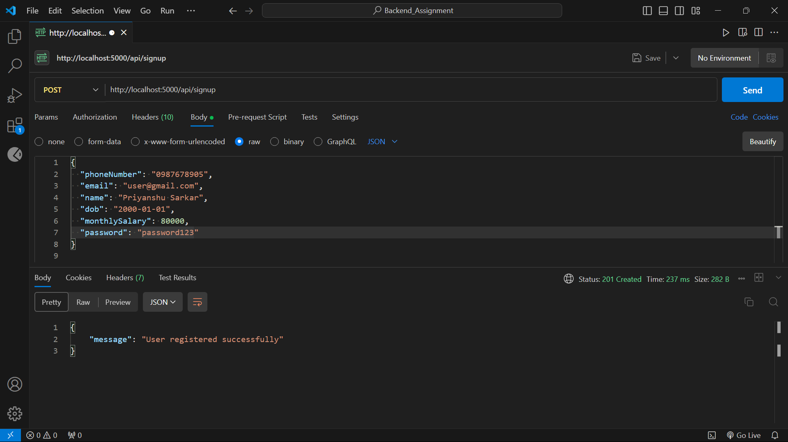
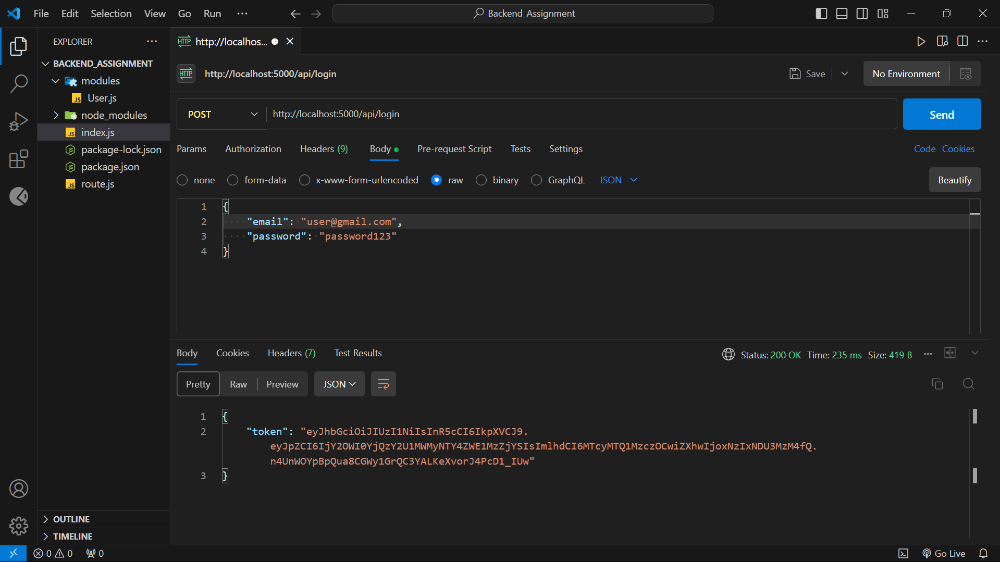
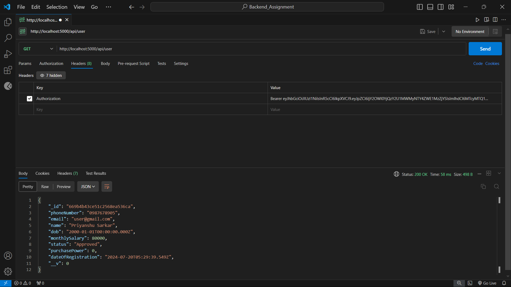
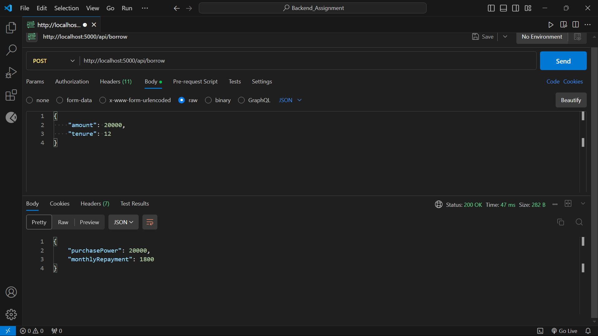

# Backend_Assignment
## API Response Screenshots

I used the Postman extension in VSCode to test the APIs. Here are the screenshots:

### Signup API Response

### Login API Response

### Get User Data API Response

### Borrow Money API Response

